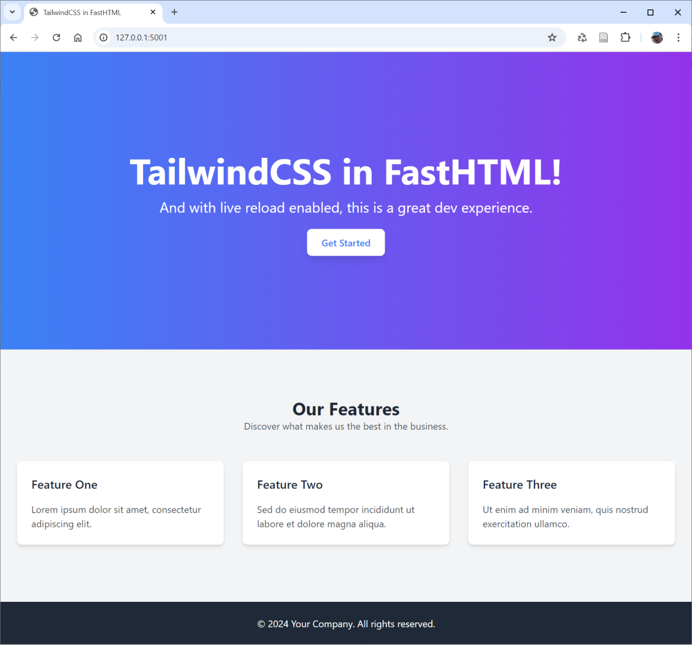
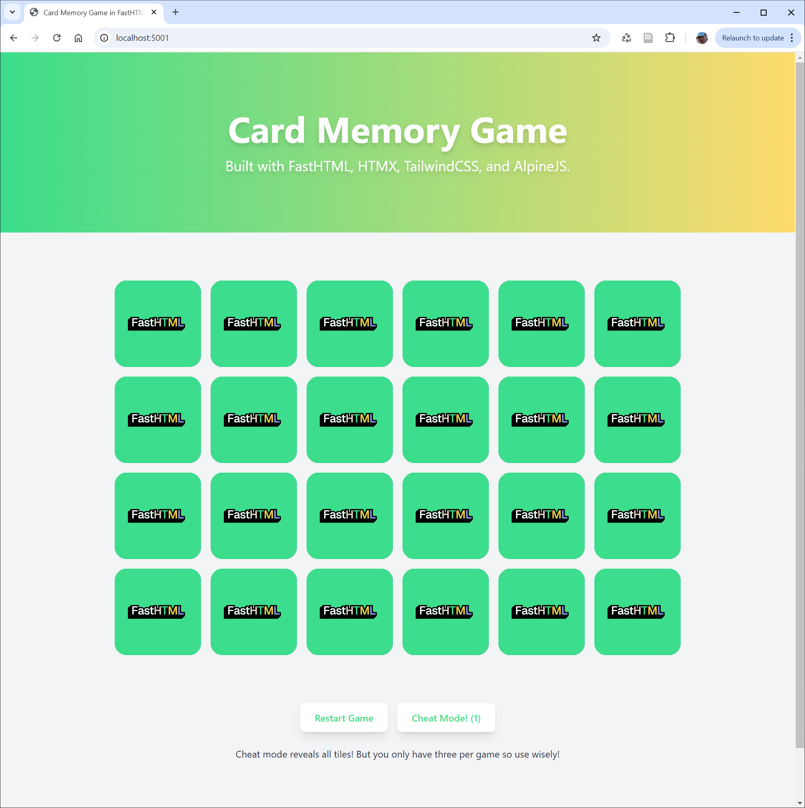

# Example FastHTML Apps

This is (or will be) a collection of demo FastHTML apps I'm creating to help me learn HTMX, FastHTML, SQLite and other related technologies.

Feel free to suggest an app! Just open a new issue.

Most of the examples have live reload enabled which provides a really nice developer experience. Every time you update Python code or a Tailwind class the app recompiles and live reloads almost instantly in the browser!

# [1. Tailwind in FastHTML](/01-tailwind-basic/)

Basic example of integrating TailwindCSS in a FastHTML app.

# [2. Card Matching Memory Game](/02-card-memory-game/)

A fun card matching memory game built with HTMX, FastHTML, and AlpineJS.

